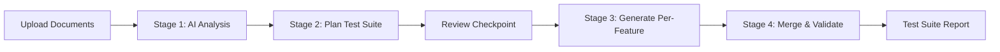

# QA Document Verifier & AI Test Case Generator

An AI-driven requirement-to-test-case validation system. Upload your **Business Requirements Document (BRD)**, **Functional Specification Document (FSD)**, **reference screenshots/mockups**, and a **Figma design link**. The system parses all documents, builds a structured understanding of features, user flows, and discrepancies, and generates a comprehensive manual test case suite—all before code is written.

---

## 🚀 How It Works (Four-Stage Pipeline)



### 📋 Stage 1 — Analyze & Understand
1. **Document Parsing**: Extracts full text from BRD and FSD documents (`.pdf` or `.docx`).
2. **Figma Screen Discovery**: Connects to the Figma API to fetch the canvas structure and frame/page names.
3. **Multimodal Analysis**: Sends the combined context (BRD + FSD text + Figma structure + reference screenshots) to a local vision-capable LLM (`qwen2.5vl:7b` or `gpt-oss:120b-cloud`).
4. **Structured Understanding**: The LLM compiles an in-app report detailing the product type, mapped features, user flows, document gaps, and inconsistencies.

### 🗺️ Stage 2 — Plan Test Suite
Using the structured understanding, the system creates a deterministic **Test Plan** that guarantees coverage. It assigns exact test case counts for every single feature (e.g. 3 Positive, 3 Negative, 2 Edge cases).

### 🧪 Stage 3 — Generate Per-Feature
The AI generates test cases in isolated LLM calls (one per feature). This prevents context overload and guarantees the generated test counts perfectly match the plan.
- **Happy-path** input/action scenarios.
- **Faulty-input** validations (boundaries, missing fields, format checks).
- **Edge cases** & specific business rules.
- **Baseline quality checks** (Navigation, Responsiveness, Error Handling, Accessibility).

### 🔗 Stage 4 — Merge & Validate
The per-feature results are compiled, sequentially numbered (TC-001, TC-002, etc.), validated for completeness, and presented as an interactive, editable table.

---

## 🛠️ Prerequisites

Ensure you have the following installed on your machine:
* **Python 3.10+**
* **Node.js 18+**
* **[Ollama](https://ollama.com)** (installed and running)
* **Figma Personal Access Token** (generate one under [Figma Developer Settings](https://www.figma.com/developers/api#access-tokens))

---

## 📦 Getting Started

### 1. Backend Setup

```bash
# Navigate to backend directory
cd backend

# Create and activate virtual environment
python -m venv venv
.\venv\Scripts\Activate.ps1   # Windows
source venv/bin/activate      # macOS/Linux

# Install dependencies
pip install -r requirements.txt

# Start the FastAPI server
python -m uvicorn app.main:app --host 0.0.0.0 --port 8000 --reload
```

Verify that the backend is active at `http://localhost:8000/api/health`.

### 2. Frontend Setup

```bash
# Navigate to frontend directory
cd frontend

# Install packages
npm install

# Run Vite dev server
npm run dev
```

Open `http://localhost:5173` in your web browser.

---

## 📝 Configuration & Customization

All server config options are in `backend/app/config.py` and `backend/app/ollama_client.py`:
* **Models**: Modify `DEFAULT_FAST_MODEL` and `DEFAULT_DEEP_MODEL` in `config.py` to swap Ollama models.
* **Test Categories**: Update `DEFAULT_BASELINE_CATEGORIES` to change the standard quality categories generated.
* **AI Modes (Temperature)**: The system supports two generation modes configurable in the UI:
  - **Strict Mode** (Temperature `0.5`): Generates highly deterministic, consistent test cases matching standard business logic.
  - **Creative Mode** (Temperature `0.9`): Explores broader edge cases and edge paths, helpful for exploratory testing scenarios.
* **System Prompts**: Modify the core LLM instructions in `backend/app/ollama_client.py` (`UNDERSTAND_SYSTEM_PROMPT` and `TESTGEN_SYSTEM_PROMPT`).

---

## 🔍 Troubleshooting & Gotchas

### 🎨 Figma Integration
> [!IMPORTANT]
> **Figma Make (`/make/`), FigJam (`/board/`), and Figma Slides (`/slides/`) URLs are not supported by the Figma REST API.**
>
> If you input a `/make/...` URL, you will receive a `400 Bad Request` stating `"File type not supported by this endpoint"`.

* **The Fix**: 
  1. Open your Figma Make or Slides workspace in your browser/app.
  2. Copy the generated design layers/frames.
  3. Paste them into a standard **Figma Design Draft**.
  4. Copy the new URL from your browser address bar. It should follow this format:
     `https://www.figma.com/design/YOUR_22_CHAR_FILE_KEY/Personal-finance-tracker-app`
  5. Paste this new URL along with your access token in the web interface.

### 🦙 Ollama Server Issues (Windows)
> [!WARNING]
> If you run `ollama list` or check the service, you might encounter:
> `Failed to start: Unable to init instance: Unspecified error`
>
> This usually happens on Windows when trying to run Ollama inside a terminal shell without access to the GUI desktop layer (since Ollama tries to load its system tray icon by default).

* **The Fix**: Run the server process directly in the console:
  ```powershell
  ollama serve
  ```
  This starts the API server on `http://localhost:11434` without launching the tray GUI.

---

## 📂 Project Structure

```
├── backend/
│   ├── app/
│   │   ├── main.py            # FastAPI entrypoint & router
│   │   ├── pipeline.py        # Two-stage pipeline (Analyze -> Generate)
│   │   ├── doc_parser.py      # PDF & Word Document text extractor
│   │   ├── figma_client.py    # Figma REST API integration
│   │   ├── ollama_client.py   # Ollama LLM prompting & API payload
│   │   ├── jobs.py            # In-memory jobs tracking
│   │   └── config.py          # Port, model, and category settings
│   └── requirements.txt       # Backend dependencies
├── frontend/
│   ├── src/
│   │   ├── App.jsx            # Main React Dashboard UI
│   │   ├── index.css          # Premium Dark UI stylesheet
│   │   └── main.jsx           # Frontend entrypoint
│   └── package.json           # Frontend dependencies
└── README.md                  # This file
```
